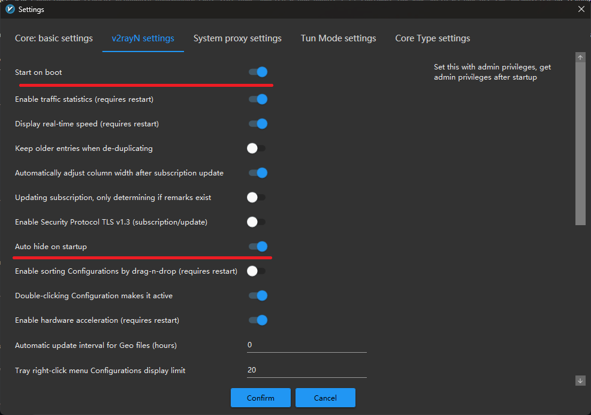

  <picture>
    <source media="(prefers-color-scheme: dark)" srcset="./media/MatsuriDayo.jpg">
    
  </picture>

Гайд изначально создавался для моего любимого <a href="https://github.com/MatsuriDayo/nekoray">Nekoray</a>, но так как он больше не обновляется, было принято решение перейти на другой софт. Мой выбор пал на очень удобный <a href="https://github.com/2dust/v2rayN">v2rayN</a>

<b>ЕСТЬ 2 СТУЛА...</b>  — по сути, у нас два пути, как мы хотим жить. Оба не сахар, но какой выбрать — решать только вам...

> [!IMPORTANT]
> Эта информация предназначена только для теории, пожалуйста, не используйте все изложенное в незаконных целях.

# 1 Путь
Этот путь я использую с 18.06. Способ удобен в условиях белых списков (которые, похоже, решил внедрять РКН). У него есть свои плюсы и минусы.
### Явным плюсом можно назвать то, что почти весь трафик идёт через иностранный сервер, игнорируя блокировки РКН. Этот плюс заметен и при работе с РУ-сайтами, так как часть из них всё ещё базируется на технологиях вроде Cloudflare, которые иногда попадают под блокировки — как можно было заметить в последние дни. При этом РУ-трафик пускается напрямую.

### Минус заключается в том, что придётся настраивать исключения для трафика, который не нужно проксировать. Особенно это неудобно для игр, так как нужно указывать все процессы, которые должны игнорировать правила проксирования.

Про процесс установки рассказывать не буду — здесь всё предельно просто: качаете нужный архив с [репозитория](https://github.com/2dust/v2rayN/releases") и устанавливаете. После того как вы скачали и запустили программу, перед вами появится следующее окно:

  <picture>
    <source media="(prefers-color-scheme: dark)" srcset="./media/1.png">
    
  </picture>

В приложении сразу лучше выбрать регион **Russia** — тогда оно автоматически начнёт подгружать необходимые ассеты:

  <picture>
    <source media="(prefers-color-scheme: dark)" srcset="./media/2.png">
    
  </picture>

Следующим шагом я предлагаю выполнить обновление всех компонентов:

  <picture>
    <source media="(prefers-color-scheme: dark)" srcset="./media/3.png">
    
  </picture>

Спустя некоторое время (~1 мин.), обновление завершиться, вам об этом скажут. Советую обновлять хотя бы раз в день, т.к. geosite/geoip обновляются раз в 6 часов.

Следующим моментом необходимо выбрать наш роутинг. **Выбираем RUv1 — Всё, кроме РФ**:

  <picture>
    <source media="(prefers-color-scheme: dark)" srcset="./media/4.png">
    
  </picture>

Далее добавим софт в автозапуск (при необходимости):

  <picture>
    <source media="(prefers-color-scheme: dark)" srcset="./media/autorun.png">
    
  </picture>

Переводим в ТУН режим:

  <picture>
    <source media="(prefers-color-scheme: dark)" srcset="./media/5.png">
    
  </picture>

И последний штрих. В трее задаем активный конфиг:

  <picture>
    <source media="(prefers-color-scheme: dark)" srcset="./media/5.png">
    
  </picture>

По сути, этого достаточно для большинства пользователей, но есть исключения — далее речь пойдёт именно о них.  
Учимся исключать необходимый софт или приложения из проксирования, чтобы их трафик шёл напрямую.  

Переходим в настройки роутинга:

  <picture>
    <source media="(prefers-color-scheme: dark)" srcset="./media/5.png">
    
  </picture>

Попадаем в данное окно:

  <picture>
    <source media="(prefers-color-scheme: dark)" srcset="./media/6.png">
    
  </picture>

Дабл кликаем по нашему **RUv1-Всё, кроме РФ** и попадаем в новое окно:

  <picture>
    <source media="(prefers-color-scheme: dark)" srcset="./media/7.png">
    
  </picture>

Сверху жмем **Add Rule**, перед нами появляется новое окно:

  <picture>
    <source media="(prefers-color-scheme: dark)" srcset="./media/8.png">
    
  </picture>

Задаём в поле **Remarks** имя для правила — я указал Приложения напрямую (так сразу понятно, что делает правило).  
Задаём **outboundTag** = **direct** — это правило игнорирует проксирование и запускает трафик напрямую.  
Далее в колонке **Full process name (Tun mode)** начинаем вписывать необходимые процессы. Тут я уже не могу подсказать, у каждого всё по-разному — ищите нужные процессы через Task Manager и вписывайте их.  
**Очень важно**! Названия чувствительны к регистру, поэтому будьте внимательны и не ошибайтесь!
После этого нажмите Confirm, Confirm, Confirm — и вы попадёте в главное окно. Конфигурация автоматически перезапустится, а правила обновятся.
**Важно**: приложение или игру в 99% случаев нужно перезагрузить для применения изменений.

# 2 путь
Этот путь я использовал до 18.06. Способ удобен, когда нужно разблокировать совсем немного ресурсов. Но в последнее время всё больше интернета попадает под блокировки, поэтому точечно что-то разблокировать становится всё сложнее — особенно это касается таких важных инфраструктур, как Cloudflare, Cloudfront и другие.
Собственно, плюсы и минусы этого способа описаны.

мяу мяу мяу
